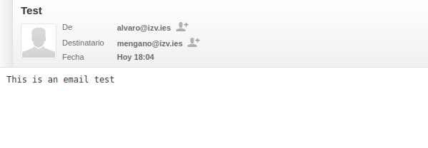

# ROUNDCUBE

## What is Roundcube?  

Roundcube is a web-based IMAP email client with a user-friendly interface. It provides a modern and responsive webmail experience, supporting features like drag-and-drop message management, address book, rich text composing, and folder management. Roundcube is open-source and can be customized with plugins and themes to fit various needs.  

## How you can use it?

### Clone the repository:

```bash
git clone https://github.com/Alvarogm27/roundcube
```

### Deploy the containers:

```bash
docker-compose up -d --build
```

### Set the dns configuration:

```bash
nano /etc/resolv.conf
```
Add this line on top: "nameserver 127.0.0.1"

### Login:

Search "http://mail.izv.ies/roundcubemail", It is roundcube's login page.


### alvaro's login:

Enter the credentials to log as the user alvaro.


### Access to the email sender:

Click on Send as you can see in the image.


### Send email to mengano:

Write your email and send to the destinator name followed by [@nameserver], in this case "mengano@izv.ies".


### Log out from alvaro:

In the top of the rigth corner you can log out.


### mengano's login:

Now to prove the emails have been correctly sended log as mengano


### Inbox:

Email recieved by mengano in her inbox.


### Email content:

Double click to acces to the email and see what's inside.


## Possible network error

### Port 53 assigned:

If your getting troubles to deploy the containers, more specifically the "dns" one it could be due to the port 53 it is already assign to systemd

#### Solution:

Edit systemd resolved.conf
```bash
nano /etc/systemd/resolved.conf:
```

Add or edit this line to let systemd use another port:
DNSStubListener=no

Restart the service:
```bash
sudo systemctl restart systemd-resolved
```
